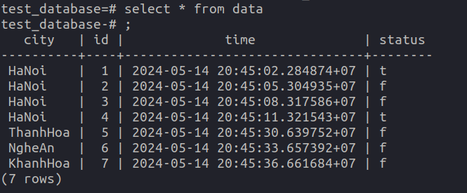

# InsertPsql
Project này chứ file python dùng để tự động tạo bảng và insert dữ liệu vào trong psql.
# Cách sử dụng
Chạy câu lệnh sau: `pip install -r requirements.txt`

Thay các biến `host`, `database`, `user`, `password`, `port` thành các giá trị thích hợp.
Ví dụ:
```python
conn = psycopg2.connect(
    host="localhost",    
    database="test_database", 
    user="admin",        
    password="phamdat280102",
    port=5432
)
```
Sau đó ta chạy code bằng câu lệnh: `python3 insertPsql.py`


Code trên sẽ tạo ra một bảng có tên là data, và tự động insert vào trong bảng 1 bản ghi sau mỗi 3 giây.

